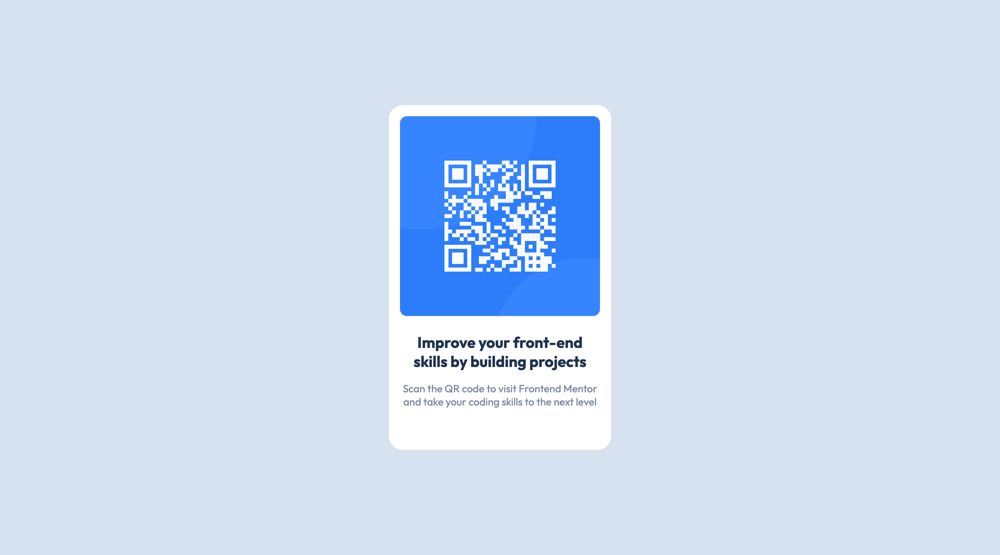

# Frontend Mentor - QR code component solution

This is a solution to the [QR code component challenge on Frontend Mentor](https://www.frontendmentor.io/challenges/qr-code-component-iux_sIO_H). Frontend Mentor challenges help you improve your coding skills by building realistic projects.

## Table of contents

- [Overview](#overview)
  - [Screenshots](#screenshots)
  - [Links](#links)
- [My process](#my-process)
  - [Built with](#built-with)
  - [Useful resources](#useful-resources)
- [Author](#author)
- [Acknowledgments](#acknowledgments)

## Overview

### Screenshots

| Mobile screenshot                                                      | Desktop Screenshot                                                       |
| ---------------------------------------------------------------------- | ------------------------------------------------------------------------ |
|  |  |

### Links

- Solution URL: [https://github.com/seanbuckle/QR-code-component](https://github.com/seanbuckle/QR-code-component)
- Live Site URL: [https://seanbuckle.github.io/QR-code-component/](https://seanbuckle.github.io/QR-code-component/)

## My process

### Built with

- Semantic HTML5 markup
- CSS custom properties
- Flexbox
- [SASS](https://sass-lang.com) - CSS preprocessor

### Useful resources

- [web.dev](https://web.dev)
- [MDN Web Docs](https://developer.mozilla.org/en-US/)

## Author

- Frontend Mentor - [@seanbuckle](https://www.frontendmentor.io/profile/yourusername)
- Linkedin - [Sean Buckle](https://www.linkedin.com/in/seanbuckle)
